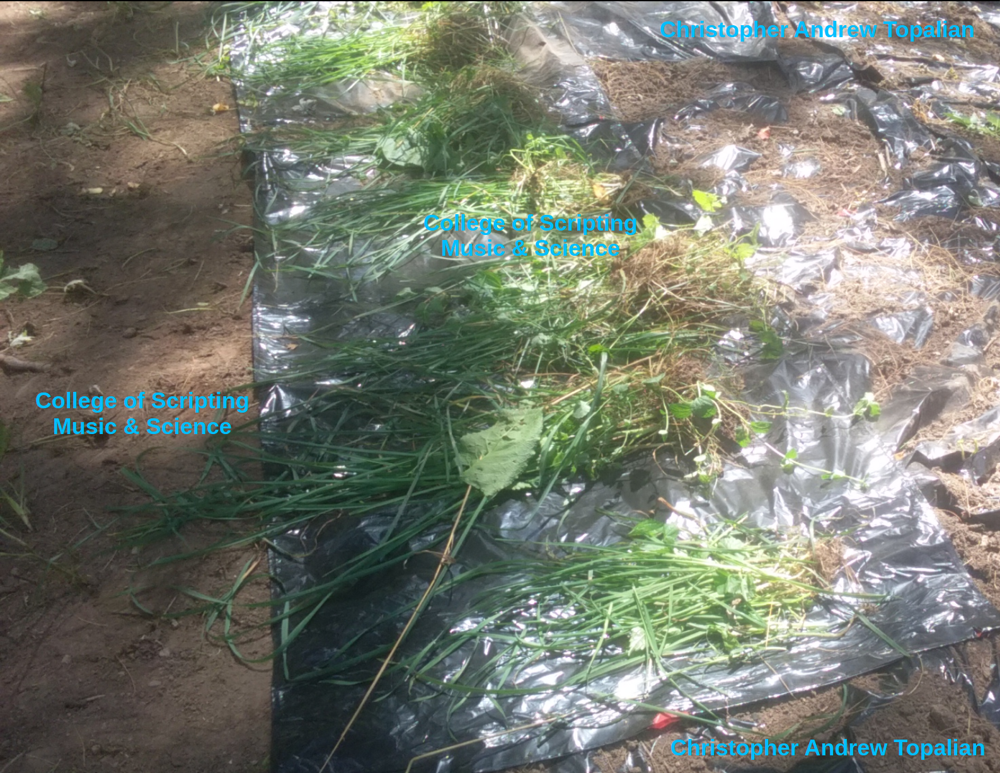

# Cut and Cover EASY

  

# EASY METHOD THAT WORKS!
**Trash Bags** are very cheap.

The reason trash bags keep working without being punctured, is because we only hold them down using light grass and weed clippings.  

After we cover the knotweed soil the knotweed sends up a spear while it has lots of energy. But the **Trash Bag Method** being covered only lightly ALLOWS the **Trash Bag** to rise instead of being punctured!  

# Easy Directions
1. We Remove the sharp rocks from the section of land that we are about to cover, that might be sharp and cause plastic bags to rip. We can use a Rock rake or remove them by hand.  Alternatively we can use a DIRT Compactor to make the land even before we apply the plastic down.  
2. We Place the Trash Bag on to the ground.  
3. After we put down this first **Trash Bag** we cover the **Trash Bag** lightly with grass and weed clippings. This keeps the **Trash Bag** from taking off in the wind, but we keep it light enough to be able to rise when the knotweed tries to puncture it!  
The grass and weed clippings also minimizes any UV damage to the plastic from the Sun.  
4. We place another **Trash Bag** down overlapping the one we put down earlier by 4". We do this in a row so that we can DEFEND our land against the knotweed advancing!  
5. We keep placing **Trash Bags** down and overlapping them and putting grass and weed clippings on top them.  

# Monitoring
1. Relax - The knotweed 100% will try to push through the plastic bags! It's okay, because the **Trash Bags** were only covered lightly so they will rise with the knotweed instead of being punctured. Over a short time, of a month, the knotweed will be exahusted and be very flexible.  
2. We will see knotweed coming up in the seams if we happen to have the **Trash Bags** not overlapping enough or if the **Trash Bags** happened to be blow some by the wind. That's okay! Relax! 
First, we can walk on top the Trash Bags without worrying about damaging them!
WE CAN WALK LIGHTLY ON THE **TRASH BAGS**!
So, we just walk to the section lightly, and removing the knotweed by hand, not shovel. Don't dig, because you would make uneven ground and the plastic bag might then rip from that divet as weight is applied to it. It is better for the ground to remain level so that the plastic will not end up with holes.  
In addition the more you disturb the plant underground the more it will send out shoots. It is better to just cover it with the least amount of disturbing it.  

# What not to do
* We Don't bother peeling up each **Trash Bag** to avoid walking on them as we walk to monitor a section, because we would end up ruining the uniformity of the covering!
# What to do instead
* JUST WALK ON THE **TRASH BAGS**. It will keep the uniformity of the covering. If we happen to walk on uneven ground or a sharp rock and a puncture happens, we can easily fix it. We can heal the puncture using another **Trash Bag** and packing tape. In addition, next season we will apply another **Trash Bag** on top of the one that is there now, so it's okay if a rip here or there occurs on the plastic.  

---

# Cost Effectiveness and Winter Preparation
* We don't have to remove the **Trash Bags** from the ground for winter. Since **Trash Bags** are so cheap we can leave the **Trash Bags** in place so that when the Spring thaw happens the knotweed won't have even a moment of sun light!  
In addition, the very first day the snow stops we can start putting more **Trash Bags** down on top of the ones from the season before. After a few seasons we will elminate the knotweed from most sections, but for very deep knotweed, we can expect 5 to 10 years of covering!

This is why it's so important to use inexpensive **Trash Bags**. For 27 dollars you can get 160 **Trash Bags**. 
This will cover a very big amount of land and will help save the yard very quickly from knotweed advancing.  

---

Compare this to landscaping material. Landscaping material or anything that is very tightly held down will likely be punctured by knotweed.
Thus, instead we design our covering to be FLEXIBLE and RISE with the knotweed instead of trying to force it down.  
The knotweed exhausts itself because it can never puncture the flexible **Trash Bag** that rises!  

Happy Gardening :-)

//----//

// Dedicated to God the Father  
// All Rights Reserved Christopher Andrew Topalian Copyright 2000-2025  
// https://github.com/ChristopherTopalian  
// https://github.com/ChristopherAndrewTopalian  
// https://sites.google.com/view/CollegeOfScripting

